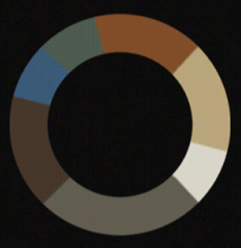
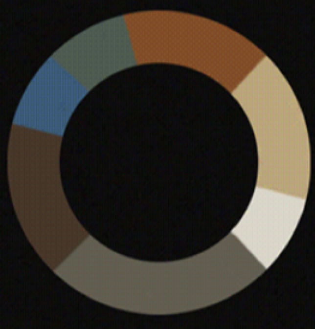
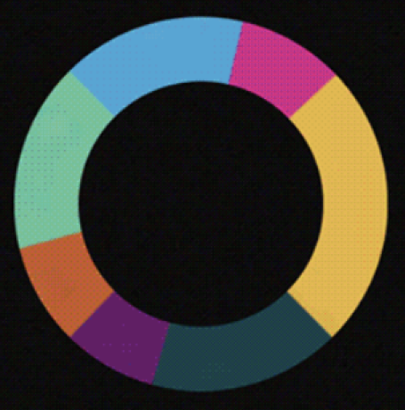
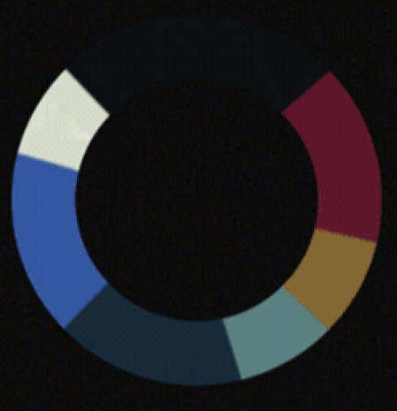
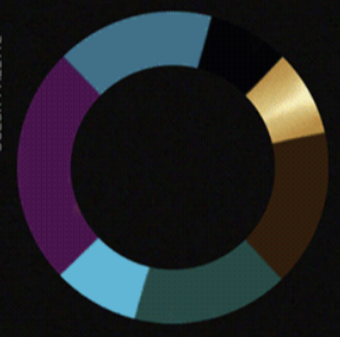

# Fonts

Rajdhani
Orbitron

# Colors

Cyberpunk 2077 Themed
Images and colors inspired from an article post by https://dribbble.com/shots/21534554-Cyberpunk-2077-PPT-Template

### Main

Light Red: #F75049
Cyan: #55ead4
Gray: #D6D0D0
Light green: #1DED83
Blue: #2570D4
Violet: #9D2BF5
Orange: #FB932E
Light Gold: #F0B537
Black: #0E0E17

### Old

Brown: #814929
Beige: #BCA07B
White: #DBD2CA
Grey: #645B4F
Dark Brown: #453528
Dark Ocean Blue: #3C5C84
Dark Green: #4D5B50

### Vibrant

Light blue: #59A5D3
Pink: #CA398A
Yellow: #DCB550
Dark Aquamarine: #1F4145
Dark Purple: #601F64
Orange-Brown: #B05E30
Turquoise: #77C19E

### Dark

Black: #0F1011
Wine Red: #5E162B
Brownish: #846834
Dark Cyan: #59807E
Dark Aquamarine: #192C37
Blue: #3457A1
White: #D8DFD1

### Gold

Black: #040406
Gold: #B9924C
Brown: #2E210C
Dark Aquamarine: #274842
Light Cyan: #61B6D5
Purple: #431047
Marine: #3E7288
